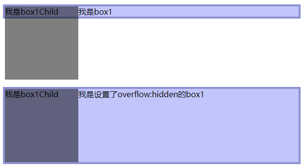
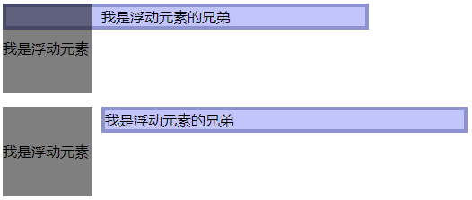

---
什么是BFC
---
官方定义：块格式化上下文（Block Formatting Context，BFC）是Web页面的可视CSS渲染的一部分，是块级盒子的布局过程发生的区域，也是浮动元素与其他元素交互的区域。

通常说的：BFC就是页面上的一个隔离的独立容器，容器里面的子元素不会影响到外面的元素。

怎么创建BFC
---
通过设置元素的某些样式来创建BFC，这些样式会产生大大小小的副作用，尽量使用副作用小的来创建BFC。
1. 浮动元素（float 值不为 none）
2. 绝对定位元素（position 值为 absolute 或 fixed）
3. display: inline-block、display: table-cell、display: table-caption、display: flex、display:inline-flex、display: grid
4. overflow值不为visible、clip的块元素  <b>(经常用)</b>
5. display: flow-root 会建立一个新的块级格式化上下文，IE不兼容，但几乎没副作用

BFC的作用
---
1. 包含内部浮动，解决高度塌陷问题
2. 排除外部浮动，BFC的区域不会与浮动的元素区域重叠
3. 阻止外边距重叠，子元素的垂直外边距不会传递给父元素
### 包含内部浮动
因为子元素浮动了，脱离了文档流，父元素的高度不在是子元素所撑起，给父元素设置BFC可以解决问题
```html
<!DOCTYPE html>
<html>
	<head>
		<meta charset="utf-8">
		<title></title>
		<style>
			*{
				margin: 0;
				padding: 0;
			}
			.box1{
				margin-top: 50px;
				margin-left: 50px;
				width: 600px;
				background-color:#c1c5fa;
				border:4px solid #8d92d1;
				overflow: visible; /* 创建了BFC，包涵浮动元素高度自然被撑起 */
			}
			.box1Child{
				width: 150px;
				height: 150px;
				background-color:rgba(0,0,0,0.5);
				float: left;
			}
		</style>
	</head>
	<body>
		<div class="box1">
			<div class="box1Child">
				我是box1Child
			</div>
			<p>我是box1</p>
		</div>
	</body>
</html>
```
下图展示了使用overflow:hidden创建BFC，box1的高度被浮动元素所撑开

### 排除外部浮动
利用浮动和BFC实现双列布局，原理是BFC的区域不会与浮动的元素区域重叠
```html
<!DOCTYPE html>
<html>
	<head>
		<meta charset="utf-8">
		<title></title>
		<style>
			*{
				margin: 0;
				padding: 0;
			}
			.box{
				margin-top: 50px;
				margin-left: 50px;
				overflow: hidden;
			}
			.box1{
				width: 100px;
				height: 100px;
				line-height: 100px;
				background-color:rgba(0,0,0,0.5);
				float: left;
				margin-right: 10px;
			}
			.box2{
				width: 400px;
				background-color:#c1c5fa;
				border:4px solid #8d92d1;
				overflow: hidden; /* 创建了BFC，元素不会与浮动元素重叠 */
			}
		</style>
	</head>
	<body>
		<div class="box">
			<div class="box1">
				我是浮动元素
			</div>
			<div class="box2">
				我是浮动元素的兄弟
			</div>
		</div>
	</body>
</html>
```

### 阻止外边距重叠
垂直排列的块元素上下外边距会发生重叠，利用BFC可以解决重叠问题。
```html
<!DOCTYPE html>
<html>
	<head>
		<meta charset="utf-8">
		<title></title>
		<style>
			*{
				margin: 0;
				padding: 0;
			}
			.box{
				margin-left: 20px;
			}
			.box1{
				width: 450px;
				height: 100px;
				line-height: 100px;
				text-align:center;
				background-color:rgba(0,0,0,0.5);
				margin: 20px 0;
			}
			.box2{
				width: 450px;
				height: 100px;
				line-height: 100px;
				text-align:center;
				background-color:#c1c5fa;
				margin-top: 10px;
			}
		</style>
	</head>
	<body>
		<div class="box">
			<div class="box1">
				我是box1
			</div>
			<div class="box2">
				我是box2
			</div>
		</div>
	</body>
</html>
```
box1和box2之间的间距并不等于30px，而是取两者之间的最大值来做间距，只用给二者之一加一层结构，让新增的结构创建BFC就能解决外间距重叠问题。
```html
<div class="box">
  <div style="overflow:hidden">
    <div class="box1">
      我是box1
    </div>
  </div>
  <div class="box2">
    我是box2
  </div>
</div>
```