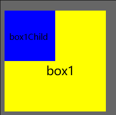

---
# 什么情况下会发生重叠

块元素中相邻的兄弟元素、父元素与第一个子元素或最后一个子元素使用margin-top和margin-bottom会造成margin重叠问题。

相邻的兄弟元素
---
box1和box2的元素之间的间距并不会叠加（20+30），最终间距是30px，取margin-top、margin-bottom中的最大值。

解决方法：给最后一个元素设置float，注意清浮动；给其中一个元素包一层div，给新增的div设置overflow:hidden、border:1px solid transparent、padding-top:1px其一；建议没使用float布局时少用margin-top。

```html
<!DOCTYPE html>
<html>
	<head>
		<meta charset="utf-8">
		<title>margin重叠问题</title>
		<style>
			.box1{
				width: 200px;
				height: 200px;
				background-color:yellow;
				overflow: hidden;
				margin-bottom: 20px;
			}
			.box2{
				width: 200px;
				height: 200px;
				background-color:green;
				margin-top: 30px;
			}
		</style>
	</head>
	<body>
		<div class="box1"></div>
		<div class="box2"></div>
	</body>
</html>
```
父元素与第一个子元素或最后一个子元素
---
box1和box1Child元素都设置了margin-top，结果却是box1向上间隔了20px而box1Child间隔box1为0px。如下图所示：  
  
解决方法：  
1. 父元素设置overflow:hidden;
2. 父元素设置padding-top:1px，整体高度减1;
3. 父元素设置border-top:1px solid transparent;
4. 给父元素或子元素设置float，注意清除浮动;
5. 给父元素或子元素设置display:inline-block;
```html
<!DOCTYPE html>
<html>
	<head>
		<meta charset="utf-8">
		<title>margin重叠问题</title>
		<style>
			.box1{
				width: 200px;
				height: 200px;
				background-color:yellow;
				margin-top: 10px;
			}
			.box1Child{
				width: 100px;
				height: 100px;
				background-color:blue;
				margin-top:20px;
			}
		</style>
	</head>
	<body>
		<div class="box1">
			<div class="box1Child"></div>
		</div>
	</body>
</html>
```