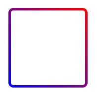

---
原理：伪元素设置渐变背景，容器覆盖在伪元素上，伪元素超出容器的部分背景则可以模拟渐变边框。  

```html
<style>
  .box{
    position: relative;
    width: 150px;
    height: 150px;
    background-color:#ffffff;
    margin: 50px auto;
    background-clip:padding-box;
    border:5px solid transparent;
    border-radius:10px;
  }
  .box::before{
    display: block;
    content:'';
    position: absolute;
    left: 0;
    right: 0;
    top: 0;
    bottom: 0;
    background: linear-gradient(45deg, blue 0%, red 100%);
    margin: -5px;
    border-radius:10px;
    z-index: -1;
  }
</style>
<div class="box"></div>
```