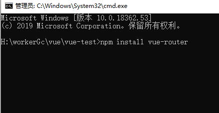

---
[Vue Router](https://router.vuejs.org/zh/) 是 Vue.js 的官方路由。它与 Vue.js 核心深度集成，让用 Vue.js 构建单页应用变得轻而易举。

安装
---
npm install vue-router安装最新版本，npm install vue-router@xxx指定版本安装。



配置router
---
在src目录下创建名为router的文件夹，里面新增index.js文件。
```js
import Vue from 'vue'
import VueRouter from 'vue-router'
import Home from '@/views/Home.vue'
import About from '@/views/About.vue'

Vue.use(VueRouter)

const routes = [
  {
    path: '/',
    name: 'Home',
    component: Home
  },
  {
    path: '/about',
    name: 'About',
    component: About
  }
]

const router = new VueRouter({
  mode:'history', //默认是hash模式
  routes
})

export default router
```
在main.js中引入router
---
```js
import Vue from 'vue'
import App from './App.vue'
import router from './router'

Vue.config.productionTip = false

new Vue({
  router,
  render: h => h(App)
}).$mount('#app')
```