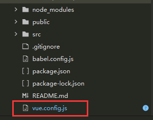

---
通过vue/cli3以上搭建的项目中没有该配置文件，需要手动创建。



基本配置如下：
```js
const path = require('path')

function resolve(dir) {
  return path.join(__dirname, dir)
}

module.exports = {
  //输出文件目录：在npm run build时，生成文件的目录名称 
  outputDir:'dist',
  //放置生成的静态资源的目录
  assetsDir: "assets",
  //如果你不需要生产环境的 source map，可以将其设置为 false 以加速生产环境构建。
  productionSourceMap: false,
  //打包app时放开该配置
  configureWebpack: config => {
    //生产环境取消 console.log
    if (process.env.NODE_ENV === 'production') {
      config.optimization.minimizer[0].options.terserOptions.compress.drop_console = true
    }
  },
  //代码保存时进行eslint检测
  lintOnSave: false,
  chainWebpack: config => {
    //设置文件夹别名
    config.resolve.alias
      .set('@$', resolve('src'))
     //生产环境，开启js\css压缩
    if (process.env.NODE_ENV === 'production') {
      config.plugin('compressionPlugin').use(new CompressionPlugin({
        test: /\.(js|css|less)$/, // 匹配文件名
        threshold: 10240, // 对超过10k的数据压缩
        deleteOriginalAssets: false // 不删除源文件
      }))
    }
  },
  //css预处理器
  css: {
    loaderOptions: {
      less: {
        modifyVars: {
          /* less 变量覆盖，用于自定义 ant design 主题 */
          /*
          'primary-color': '#F5222D',
          'link-color': '#F5222D',
          'border-radius-base': '4px',
          */
        },
        javascriptEnabled: true
      }
    }
  },
  // webpack-dev-server 相关配置
  devServer: {
    //自动打开浏览器
    open: true,
    //端口
    port: 3000,
    //代理处理跨域
    proxy: {
      '/api': {
        //目标代理服务器地址
        target: 'https://api.boot.jeecg.com',
        ws: false,
        //开启代理，本地创建一个虚拟服务器 允许跨域
        changeOrigin: true
      }
    }
  },
}
```