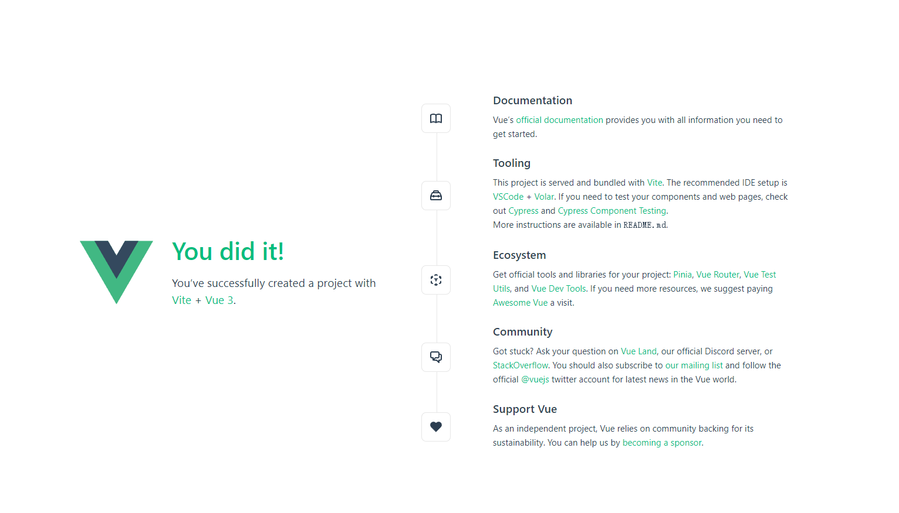

---
使用npm(默认安装了Node.js建议版本16以上)

<pre>
  <code>npm init vue@latest</code>
</pre>

按需添加
<pre>
  <code>√ Project name: ... vue-project
  √ Add TypeScript? ... No / Yes
  √ Add JSX Support? ... No / Yes
  √ Add Vue Router for Single Page Application development? ... No / Yes
  √ Add Pinia for state management? ... No / Yes
  √ Add Vitest for Unit Testing? ... No / Yes
  √ Add an End-to-End Testing Solution? » No
  √ Add ESLint for code quality? ... No / Yes</code>
</pre>

创建好项目后一定要安装依赖，默认是不会安装的
<pre>
  <code>npm install</code>
</pre>

安装好依赖之后，终端输入npm run dev运行项目，配置可以看package.json
<pre>
  <code>"scripts": {
    "dev": "vite",
    "build": "vite build",
    "preview": "vite preview"
  }</code>
</pre>

出现下图代表项目运行成功了。[Vue官方文档](https://cn.vuejs.org/guide/quick-start.html)

