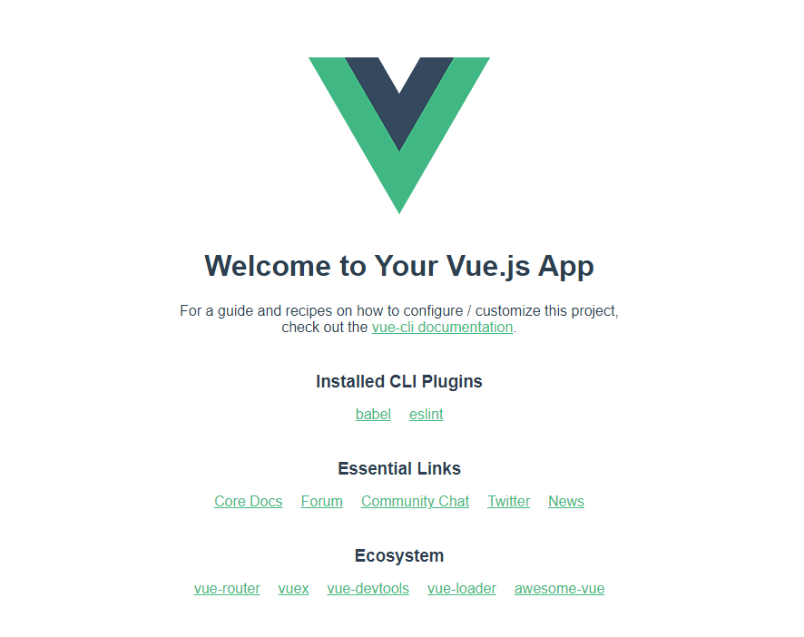

---
安装Node.js
---
电脑上没装Node.js的先从[Node.js官网](https://nodejs.org/zh-cn/)下载安装，主要是用到Node.js附带的npm软件包管理工具。下载好后点击安装，选择安装位置，一直下一步就行。

安装完成之后win+r输入cmd，检测Node.js和npm是否安装成功。输入node -v查看Node.js版本，npm -v查看npm版本。

安装vue-cli
---
目前我使用的是脚手架4.0以上的版本，可以安装最新版本，也可以指定版本安装，命令行输入npm install -g @vue/cli@4.5.13，安装完后vue -V查看版本。

搭建项目
---
有两种方式创建项目命令行搭建、利用vue ui搭建。

**1、命令行搭建**

命令行输入vue create xxx(项目名不能是驼峰式命名)，选择vue版本，按键盘方向下键选择，这里我安装的是vue2。

选择默认的包管理工具，随便选一个就行。

项目搭建好后就会生成项目名对应的文件夹，如果文件夹中没有node_modules这个文件夹，npm install就行了。

最后在命令行输入npm run serve，项目正常运行起来我们的第一个Vue项目就成功搭建好了。

**2、vue ui搭建**

命令行输入vue ui，打开Vue项目管理器。

点击再次创建新项目，输入项目名选择包管理器，其他默认，点击下一步。

选择Vue版本，点击创建项目，稍微等待一两分钟项目就创建好了。

项目创建好后会跳到一个类似控制台的地方，在这里你可以管理你搭建的项目。

最后在命令行输入npm run serve，项目正常运行起来我们的第一个Vue项目就成功搭建好了。

